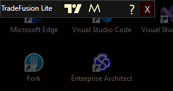
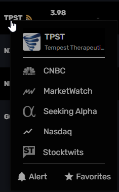

# TradeFusion Lite

TradeFusion Lite is a cutting-edge Windows software designed for day traders who leverage the power of the TWS API to trade US stocks. In this initial release, TradeFusion Lite enhances your trading experience by seamlessly integrating with MOMO Scanners and TradingView.

## Free to Use

TradeFusion Lite is available for free. If you find this software useful and would like to support its development, please consider making a donation. Your support is greatly appreciated!

[Donate via PayPal](https://www.paypal.com/donate/?hosted_button_id=EPCNNB4SX99YU)
Please donate only after you have successfully tested the software. 

Think about how often you use the software and how much it supports you and only then set an amount that adequately expresses your gratitude, if available :-)

## Key Features

- **MOMO Click Integration:** Effortlessly click on any symbol in MOMO Scanners, and TradeFusion Lite will automatically select and open the symbol in TradingView, saving you time and enhancing your trading efficiency.
- **Enhanced Trading Workflow:** Streamline your trading process with instant symbol synchronization between MOMO Scanners and TradingView, allowing you to make quick, informed decisions.
- **User-Friendly Interface:** Designed with traders in mind, TradeFusion Lite offers an intuitive interface that simplifies the trading process and minimizes the learning curve.

Take your trading to the next level with TradeFusion Lite, the essential tool for modern day traders.

## Installation

1. download and unpack the [zip archive](releases/TradeFusion%20Lite.v.0.0.1.zip) in a directory of your choice (e.g. C:\TradeFusion Lite)
2. start the file "TradeFusion Lite.exe"
3. positively confirm or ignore any Windows and/or firewall warnings The software is very simple, contains no adverts or spyware and is therefore not malware. If you have any questions or doubts, please send me an e-mail.
4. important: TradeFusion Lite starts at the top left of the main screen: 

     

5. sign in to MOMO and TradingView

## Usage
* TradeFusion Lite memorises the position of the open windows and restores the saved positions when the application is started.
* F1 - moves the selected or activated window to the top left corner of the main screen
* F5 - updates (refresh/reload) the content of the selected window (only MOMO or TradingView, the very small main window cannot be updated)
* Left-click on an icon in MOMO automatically selects the icon in TradingView
* Right-click on an icon in MOMO shows the familiar MOMO ContextMenu  
  
  

For fans:
These are two small separate windows that navigate to the MOMO or TradingView sites using CEF-Sharp. CEF.Sharp is a Chromium plugin. The software simply listens to the REST calls, extracts the clicked symbol and sends it to the TradingView window.

Translated with DeepL.com (free version)
